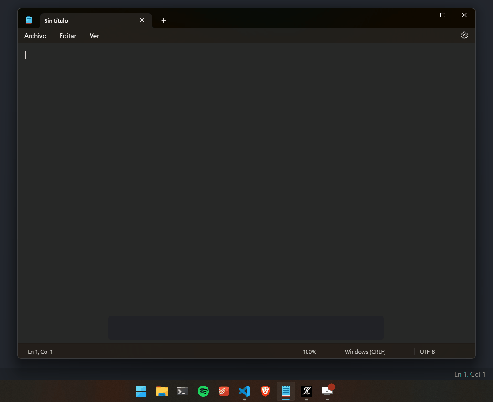

  

<h1 align="center">KoS - Key On Screen</h1>

  <strong>⌨️ Show in your screen the keys you are pressing</strong>
   
  <i>Built with ❤️‍🔥 by <a href="https://github.com/dubisdev">@dubisdev</a></i>

  <a href="https://github.com/dubisdev/key-on-screen/releases/latest">
    🔗 Download KoS
  </a>
    &nbsp; | &nbsp; Give it a Star ⭐

  
  

## Screenshots

    

<!-- 

    
    

 -->

<!-- ## ⬇️ Installation

⚠️ KoS is not signed for now, so you might deal with Windows defender.

Once downloaded, go to your downloads folder and click on the executable.

When Windows defender pops up:

1. Select "More info"
2. Then "Run anyway" -->

<!-- Be sure you download KoS from the [official release link]() -->

## ⚖️ License

MIT © David Jiménez 2026

